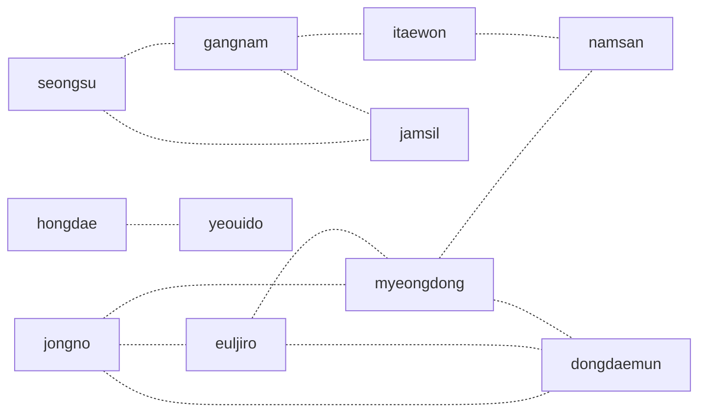
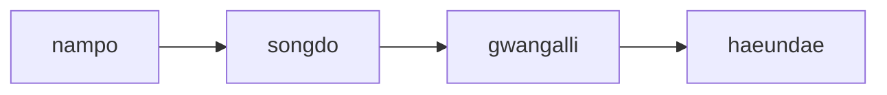
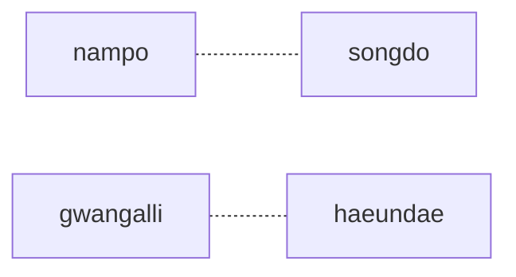
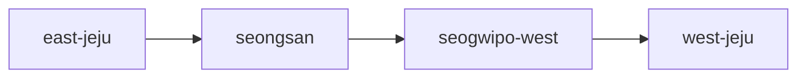
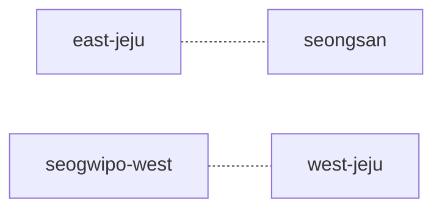

# Rule Planner City Diagrams

이 문서는 `Rule Planner`의 도시별 권역 구조를 빠르게 파악하기 위한 시각 자료다.  
정책 설명 본문은 `docs/rule_planner_city_policies.md`를 보고, 권역별 실제 장소 묶음은 `docs/rule_planner_city_place_map.md`를 보면 된다.

## 읽는 법

- 실선 화살표 `-->`
  - 기본 권역 우선순서 또는 추천 흐름
- 점선 연결 `-.-`
  - `neighbor_area_bonus`가 붙는 인접 권역 관계

## Seoul

### Route Order

### Neighbor Graph

### Quick Notes

- 중심권: `jongno`, `euljiro`, `myeongdong`, `dongdaemun`
- 동남권: `seongsu`, `gangnam`, `jamsil`
- 서남권: `hongdae`, `yeouido`
- 전환축: `itaewon`, `namsan`

## Busan

### Route Order

### Neighbor Graph

### Quick Notes

- 원도심 축: `nampo`, `songdo`
- 동부 해변 축: `gwangalli`, `haeundae`
- 현재 부산 데이터는 권역 수가 적어서 단순한 2축 구조로 관리한다.

## Jeju

### Route Order

### Neighbor Graph

### Quick Notes

- 동부 기본 축: `east-jeju`, `seongsan`
- 서부/중문 축: `seogwipo-west`, `west-jeju`
- 실제 지도 거리 기반 모델이 아니라 현재 데이터 묶음 기준의 운영 다이어그램이다.

## 확장 기준

새 도시를 추가할 때는 아래 순서로 다이어그램까지 함께 관리하는 것을 권장한다.

1. 데이터 슬러그 확정
2. 권역 순서 상수 추가
3. 인접 권역 상수 추가
4. 도시 정책 파일 추가
5. 본 문서에 `Route Order`, `Neighbor Graph`, `Quick Notes` 추가
